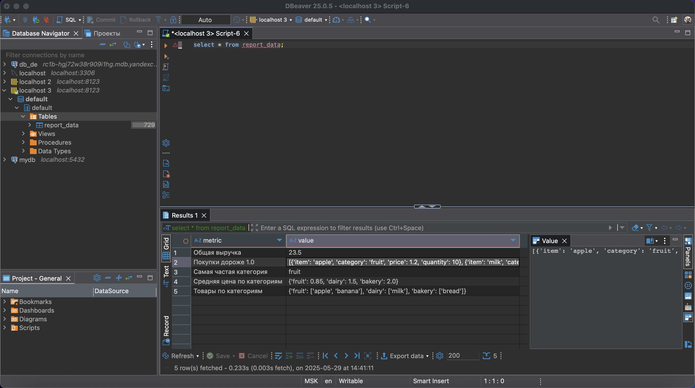
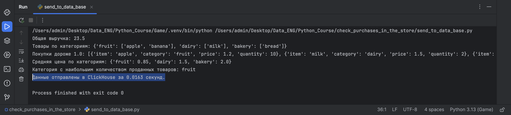

# 📊 Отчёт по покупкам и отправка данных в ClickHouse

## Описание

Этот проект предназначен для анализа списка покупок и отправки отчётных метрик в базу данных ClickHouse.  
Скрипт:

- Вычисляет общую выручку
- Группирует товары по категориям
- Определяет покупки дороже заданной цены
- Подсчитывает среднюю цену по категориям
- Выявляет категорию с наибольшим количеством продаж
- Отправляет эти данные в таблицу `report_data` ClickHouse
- Показывает, за сколько секунд данные были отправлены

## 📁 Структура проекта

```bash
├── main.py                    # Модуль с логикой анализа покупок
├── send_to_data_base.py       # Отправка отчёта в ClickHouse и замер времени
├── docker-compose.yml
├── media/
│   ├── DBeaver.png
│   ├── Main_Script.png
│   └── Timer_Work.png
└── README.md                  # Документация проекта
```

## 🐳 Docker ClickHouse

Для работы используется ClickHouse в Docker. Минимальный `docker-compose.yml`:

```yaml
version: '3'
services:
  clickhouse:
    image: clickhouse/clickhouse-server:latest
    container_name: clickhouse
    environment:
      CLICKHOUSE_USER: admin
      CLICKHOUSE_PASSWORD: secret
    ports:
      - "8123:8123"
      - "9000:9000"
    volumes:
      - clickhouse_data:/var/lib/clickhouse

volumes:
  clickhouse_data:
```

## 🚀 Как запустить

1. Убедитесь, что Docker установлен и запущен
2. Запустите ClickHouse:
   ```bash
   docker-compose up -d
   ```
3. Установите зависимости:
   ```bash
   pip install clickhouse-connect
   ```
4. Запустите скрипт:
   ```bash
   python send_to_data_base.py
   ```

## ✅ Что вы получите

Пример выводимых данных:
```
Общая выручка: 20.5
Товары по категориям: {'fruit': ['apple', 'banana'], 'dairy': ['milk'], 'bakery': ['bread']}
Покупки дороже 1.0: [{'item': 'apple', ...}]
Средняя цена по категориям: {'fruit': 0.85, 'dairy': 1.5, 'bakery': 2.0}
Категория с наибольшим количеством проданных товаров: fruit
Данные отправлены в ClickHouse за 0.0074 секунд.
```

## 🖼️ Скриншоты

| Результат DBeaver | Отчет                        | Отправка данных              |
|---------------|------------------------------|------------------------------|
|  |  |  |

## 📌 Зависимости

- Python 3.9+
- [clickhouse-connect](https://pypi.org/project/clickhouse-connect/)
- Docker + Docker Compose

